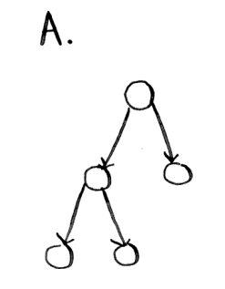
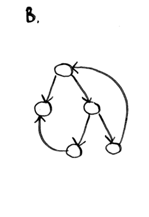
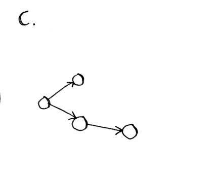

## Which of the Following Graphs are Trees?

### Properties of a Tree:

1. **Connected**: There must be a path between any two nodes.
2. **Acyclic**: There are no cycles in the graph.
3. **N-1 Edges**: A tree with \( N \) nodes must have exactly \( N - 1 \) edges.

### Evaluation of Each Graph:

#### Graph A:

 <!-- Replace with the actual image path -->

- It looks like a connected acyclic graph with several nodes.
- There are no cycles.
- The number of edges is consistent with the number of nodes (you can count and verify).
- **Conclusion**: **Graph A is a tree.**

#### Graph B:

 <!-- Replace with the actual image path -->

- This graph appears to have cycles (for example, the back edge).
- There are also multiple paths between certain nodes, suggesting it is not connected in the tree sense.
- **Conclusion**: **Graph B is not a tree.**

#### Graph C:

 <!-- Replace with the actual image path -->

- This graph has nodes that are connected and appears to be acyclic.
- It looks like a possible tree structure.
- Count the nodes and edges to make sure it follows the \( N - 1 \) rule: if there are 3 nodes, there should be 2 edges.
- **Conclusion**: **Graph C is a tree.**

### Final Answer:

- **Graphs A and C are trees.**
- **Graph B is not a tree.**
